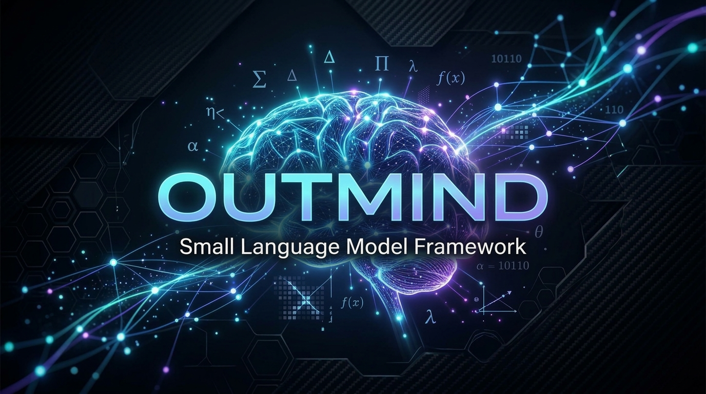

  

  <h1>OutMind 🧠</h1>
  
<strong>A minimalist, hackable, and educational open-source framework for building, pretraining, and fine-tuning Small Language Models (SLMs) from scratch.</strong>

  

    
    
    
    
  

---

## ✨ Features

- **Modern Decoder-Only Transformer**: Pre-RMSNorm, Rotary Position Embeddings (RoPE), SwiGLU activations, Grouped-Query Attention (GQA), and real-time KV-Caching with uniform 2,048 sequence length.
- **Sparse Mixture of Experts (MoE)**: Educational top-2 routed experts + shared expert architecture.
- **Cascaded Attention Acceleration**: 4-tier automated fallback (`FlashAttention-3` ➔ `FlashAttention-2` ➔ `PyTorch SDPA` ➔ `Eager Math`) ensuring zero setup crashes on any OS (Windows, Linux, macOS) or device (NVIDIA GPU, Apple MPS, CPU).
- **Indonesian & Multilingual BPE Tokenizer**: 64,000 capacity BPE with an enhanced regex splitter natively supporting Indonesian reduplications (`anak-anak`), acronym clitics (`KTP-nya`), and contractions (`'kan`).
- **Complete Lifecycle**: Tokenizer Training ➔ Pretraining (PT) ➔ Supervised Fine-Tuning (SFT with prompt masking) ➔ Parameter-Efficient Fine-Tuning (**Native PyTorch LoRA**).
- **Unified Evaluation Suite**: Modern Hugging Face benchmark integration across Tokenizer, Pretrain Perplexity, GSM8k (Math), HumanEval (Code), MMLU (Reasoning), TyDiQA (Indonesian QA), and Glaive (Tool Calling).

---

## 📚 Technical Documentation

All detailed architectural specifications, formulas, and training details are maintained in the [`docs/`](docs/README.md) directory:

- 🏗️ **[Architecture Specification](docs/architecture.md)**: Transformer layers, RoPE, RMSNorm, GQA, MoE gating, and parameter presets.
- ⚡ **[Training & Optimization](docs/training_and_optimization.md)**: AdamW decoupled weight decay, 4-tier attention fallback, Native LoRA ($r=8$), and mixed precision (AMP).
- 🔤 **[Tokenizer & Data Pipeline](docs/tokenizer_and_data.md)**: 64,000 token vocabulary, Indonesian-optimized BPE regex splitter, and SFT prompt loss masking.

---

## 📏 Model Scale Presets

| Preset | Parameters | Layers | Hidden Dim | Attention Heads (Q/KV) | Max Seq Len | Hardware Target |
| :--- | :--- | :--- | :--- | :--- | :--- | :--- |
| **OutMind-Nano** | ~34M | 6 | 384 | 6 / 2 (GQA) | 2,048 | Laptop CPU |
| **OutMind-Small** | ~125M | 12 | 768 | 12 / 4 (GQA) | 2,048 | Single GPU (RTX 3060/4060) |
| **OutMind-MoE** | ~122M (~49M active) | 8 | 512 | 8 / 2 (GQA) | 2,048 | Single GPU (8GB VRAM) |

---

## 📄 License
This project is licensed under the [Apache 2.0 License](LICENSE).  
Copyright © 2026 **Mesosfer-AI**. All rights reserved.
